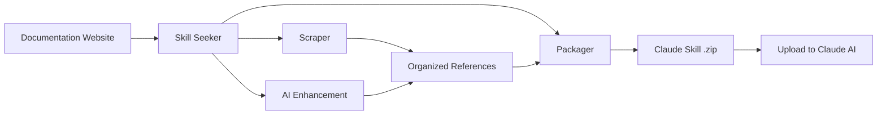

[](https://mseep.ai/app/yusufkaraaslan-skill-seekers)

# Skill Seeker

[](https://github.com/yusufkaraaslan/Skill_Seekers/releases/tag/v1.2.0)
[](https://opensource.org/licenses/MIT)
[](https://www.python.org/downloads/)
[](https://modelcontextprotocol.io)
[](tests/)
[](https://github.com/users/yusufkaraaslan/projects/2)

**Automatically convert any documentation website into a Claude AI skill in minutes.**

> 📋 **[View Development Roadmap & Tasks](https://github.com/users/yusufkaraaslan/projects/2)** - 134 tasks across 10 categories, pick any to contribute!

## What is Skill Seeker?

Skill Seeker is an automated tool that transforms any documentation website into a production-ready [Claude AI skill](https://claude.ai). Instead of manually reading and summarizing documentation, Skill Seeker:

1. **Scrapes** documentation websites automatically
2. **Organizes** content into categorized reference files
3. **Enhances** with AI to extract best examples and key concepts
4. **Packages** everything into an uploadable `.zip` file for Claude

**Result:** Get comprehensive Claude skills for any framework, API, or tool in 20-40 minutes instead of hours of manual work.

## Why Use This?

- 🎯 **For Developers**: Quickly create Claude skills for your favorite frameworks (React, Vue, Django, etc.)
- 🎮 **For Game Devs**: Generate skills for game engines (Godot, Unity documentation, etc.)
- 🔧 **For Teams**: Create internal documentation skills for your company's APIs
- 📚 **For Learners**: Build comprehensive reference skills for technologies you're learning

## Key Features

### 🌐 Documentation Scraping
- ✅ **llms.txt Support** - Automatically detects and uses LLM-ready documentation files (10x faster)
- ✅ **Universal Scraper** - Works with ANY documentation website
- ✅ **Smart Categorization** - Automatically organizes content by topic
- ✅ **Code Language Detection** - Recognizes Python, JavaScript, C++, GDScript, etc.
- ✅ **8 Ready-to-Use Presets** - Godot, React, Vue, Django, FastAPI, and more

### 📄 PDF Support (**v1.2.0**)
- ✅ **Basic PDF Extraction** - Extract text, code, and images from PDF files
- ✅ **OCR for Scanned PDFs** - Extract text from scanned documents
- ✅ **Password-Protected PDFs** - Handle encrypted PDFs
- ✅ **Table Extraction** - Extract complex tables from PDFs
- ✅ **Parallel Processing** - 3x faster for large PDFs
- ✅ **Intelligent Caching** - 50% faster on re-runs

### 🤖 AI & Enhancement
- ✅ **AI-Powered Enhancement** - Transforms basic templates into comprehensive guides
- ✅ **No API Costs** - FREE local enhancement using Claude Code Max
- ✅ **MCP Server for Claude Code** - Use directly from Claude Code with natural language

### ⚡ Performance & Scale
- ✅ **Large Documentation Support** - Handle 10K-40K+ page docs with intelligent splitting
- ✅ **Router/Hub Skills** - Intelligent routing to specialized sub-skills
- ✅ **Parallel Scraping** - Process multiple skills simultaneously
- ✅ **Checkpoint/Resume** - Never lose progress on long scrapes
- ✅ **Caching System** - Scrape once, rebuild instantly

### ✅ Quality Assurance
- ✅ **Fully Tested** - 207 tests with 100% pass rate

## Quick Example

### Option 1: Use from Claude Code (Recommended)

```bash
# One-time setup (5 minutes)
./setup_mcp.sh

# Then in Claude Code, just ask:
"Generate a React skill from https://react.dev/"
"Scrape PDF at docs/manual.pdf and create skill"
```

**Time:** Automated | **Quality:** Production-ready | **Cost:** Free

### Option 2: Use CLI Directly (HTML Docs)

```bash
# Install dependencies (one command!)
uv sync

# Generate a React skill in one command
uv run skill-seekers --config configs/react.json --enhance-local

# Upload output/react.zip to Claude - Done!
```

**Time:** ~25 minutes | **Quality:** Production-ready | **Cost:** Free

### Option 3: Use CLI for PDF Documentation

```bash
# Install dependencies with PDF support
uv sync --extra pdf

# Basic PDF extraction
uv run skill-seeker-pdf --pdf docs/manual.pdf --name myskill

# Advanced features
uv run skill-seeker-pdf --pdf docs/manual.pdf --name myskill \
    --extract-tables \        # Extract tables
    --parallel \              # Fast parallel processing
    --workers 8               # Use 8 CPU cores

# Scanned PDFs
uv run skill-seeker-pdf --pdf docs/scanned.pdf --name myskill --ocr

# Password-protected PDFs
uv run skill-seeker-pdf --pdf docs/encrypted.pdf --name myskill --password mypassword

# Upload output/myskill.zip to Claude - Done!
```

**Time:** ~5-15 minutes (or 2-5 minutes with parallel) | **Quality:** Production-ready | **Cost:** Free

**Advanced Features:**
- ✅ OCR for scanned PDFs (requires pytesseract)
- ✅ Password-protected PDF support
- ✅ Table extraction
- ✅ Parallel processing (3x faster)
- ✅ Intelligent caching

## How It Works



0. **Detect llms.txt** - Checks for llms-full.txt, llms.txt, llms-small.txt first
1. **Scrape**: Extracts all pages from documentation
2. **Categorize**: Organizes content into topics (API, guides, tutorials, etc.)
3. **Enhance**: AI analyzes docs and creates comprehensive SKILL.md with examples
4. **Package**: Bundles everything into a Claude-ready `.zip` file

## 📋 Prerequisites

**Before you start, make sure you have:**

1. **Python 3.10 or higher** - [Download](https://www.python.org/downloads/) | Check: `python3 --version`
2. **UV package manager** - [Install Guide](https://docs.astral.sh/uv/) | Check: `uv --version`
3. **Git** - [Download](https://git-scm.com/) | Check: `git --version`
4. **15-30 minutes** for first-time setup

**Installing UV:**
```bash
# macOS/Linux
curl -LsSf https://astral.sh/uv/install.sh | sh

# Windows
powershell -c "irm https://astral.sh/uv/install.ps1 | iex"
```

**First time user?** → **[Start Here: Bulletproof Quick Start Guide](BULLETPROOF_QUICKSTART.md)** 🎯

This guide walks you through EVERYTHING step-by-step (UV install, git clone, first skill creation).

---

## 🚀 Quick Start

### Method 1: MCP Server for Claude Code (Easiest)

Use Skill Seeker directly from Claude Code with natural language!

```bash
# Clone repository
git clone https://github.com/yusufkaraaslan/Skill_Seekers.git
cd Skill_Seekers

# One-time setup (5 minutes)
./setup_mcp.sh

# Restart Claude Code, then just ask:
```

**In Claude Code:**
```
List all available configs
Generate config for Tailwind at https://tailwindcss.com/docs
Scrape docs using configs/react.json
Package skill at output/react/
```

**Benefits:**
- ✅ No manual CLI commands
- ✅ Natural language interface
- ✅ Integrated with your workflow
- ✅ 9 tools available instantly (includes automatic upload!)
- ✅ **Tested and working** in production

**Full guides:**
- 📘 [MCP Setup Guide](docs/MCP_SETUP.md) - Complete installation instructions
- 🧪 [MCP Testing Guide](docs/TEST_MCP_IN_CLAUDE_CODE.md) - Test all 9 tools
- 📦 [Large Documentation Guide](docs/LARGE_DOCUMENTATION.md) - Handle 10K-40K+ pages
- 📤 [Upload Guide](docs/UPLOAD_GUIDE.md) - How to upload skills to Claude

### Method 2: CLI (Traditional)

#### One-Time Setup with UV (Recommended)

```bash
# Clone repository
git clone https://github.com/yusufkaraaslan/Skill_Seekers.git
cd Skill_Seekers

# Install dependencies (creates .venv automatically)
uv sync

# Optional: Install with PDF support
uv sync --extra pdf

# Optional: Install with all features
uv sync --all-extras
```

**That's it!** No need to activate virtual environments. Just use `uv run` commands.

#### Easiest: Use a Preset

```bash
# Optional: Estimate pages first (fast, 1-2 minutes)
uv run skill-seeker-estimate configs/godot.json

# Use Godot preset
uv run skill-seekers --config configs/godot.json

# Use React preset
uv run skill-seekers --config configs/react.json

# See all presets
ls configs/
```

#### Alternative: Traditional pip/venv Method

If you prefer the old way, see [UV_MIGRATION.md](UV_MIGRATION.md) for instructions.

### Interactive Mode

```bash
uv run skill-seekers --interactive
```

### Quick Mode

```bash
uv run skill-seekers \
  --name react \
  --url https://react.dev/ \
  --description "React framework for UIs"
```

## 📤 Uploading Skills to Claude

Once your skill is packaged, you need to upload it to Claude:

### Option 1: Automatic Upload (API-based)

```bash
# Set your API key (one-time)
export ANTHROPIC_API_KEY=sk-ant-...

# Package and upload automatically
uv run skill-seeker-package output/react/ --upload

# OR upload existing .zip
uv run skill-seeker-upload output/react.zip
```

**Benefits:**
- ✅ Fully automatic
- ✅ No manual steps
- ✅ Works from command line

**Requirements:**
- Anthropic API key (get from https://console.anthropic.com/)

### Option 2: Manual Upload (No API Key)

```bash
# Package skill
uv run skill-seeker-package output/react/

# This will:
# 1. Create output/react.zip
# 2. Open the output/ folder automatically
# 3. Show upload instructions

# Then manually upload:
# - Go to https://claude.ai/skills
# - Click "Upload Skill"
# - Select output/react.zip
# - Done!
```

**Benefits:**
- ✅ No API key needed
- ✅ Works for everyone
- ✅ Folder opens automatically

### Option 3: Claude Code (MCP) - Smart & Automatic

```
In Claude Code, just ask:
"Package and upload the React skill"

# With API key set:
# - Packages the skill
# - Uploads to Claude automatically
# - Done! ✅

# Without API key:
# - Packages the skill
# - Shows where to find the .zip
# - Provides manual upload instructions
```

**Benefits:**
- ✅ Natural language
- ✅ Smart auto-detection (uploads if API key available)
- ✅ Works with or without API key
- ✅ No errors or failures

---

## 📁 Simple Structure

```
doc-to-skill/
├── cli/
│   ├── doc_scraper.py      # Main scraping tool
│   ├── package_skill.py    # Package to .zip
│   ├── upload_skill.py     # Auto-upload (API)
│   └── enhance_skill.py    # AI enhancement
├── mcp/                    # MCP server for Claude Code
│   └── server.py           # 9 MCP tools
├── configs/                # Preset configurations
│   ├── godot.json         # Godot Engine
│   ├── react.json         # React
│   ├── vue.json           # Vue.js
│   ├── django.json        # Django
│   └── fastapi.json       # FastAPI
└── output/                 # All output (auto-created)
    ├── godot_data/        # Scraped data
    ├── godot/             # Built skill
    └── godot.zip          # Packaged skill
```

## ✨ Features

### 1. Fast Page Estimation (NEW!)

```bash
uv run skill-seeker-estimate configs/react.json

# Output:
📊 ESTIMATION RESULTS
✅ Pages Discovered: 180
📈 Estimated Total: 230
⏱️  Time Elapsed: 1.2 minutes
💡 Recommended max_pages: 280
```

**Benefits:**
- Know page count BEFORE scraping (saves time)
- Validates URL patterns work correctly
- Estimates total scraping time
- Recommends optimal `max_pages` setting
- Fast (1-2 minutes vs 20-40 minutes full scrape)

### 2. Auto-Detect Existing Data

```bash
uv run skill-seekers --config configs/godot.json

# If data exists:
✓ Found existing data: 245 pages
Use existing data? (y/n): y
⏭️  Skipping scrape, using existing data
```

### 3. Knowledge Generation

**Automatic pattern extraction:**
- Extracts common code patterns from docs
- Detects programming language
- Creates quick reference with real examples
- Smarter categorization with scoring

**Enhanced SKILL.md:**
- Real code examples from documentation
- Language-annotated code blocks
- Common patterns section
- Quick reference from actual usage examples

### 4. Smart Categorization

Automatically infers categories from:
- URL structure
- Page titles
- Content keywords
- With scoring for better accuracy

### 5. Code Language Detection

```python
# Automatically detects:
- Python (def, import, from)
- JavaScript (const, let, =>)
- GDScript (func, var, extends)
- C++ (#include, int main)
- And more...
```

### 5. Skip Scraping

```bash
# Scrape once
uv run skill-seekers --config configs/react.json

# Later, just rebuild (instant)
uv run skill-seekers --config configs/react.json --skip-scrape
```

### 6. AI-Powered SKILL.md Enhancement

```bash
# Option 1: During scraping (API-based, requires API key)
pip3 install anthropic
export ANTHROPIC_API_KEY=sk-ant-...
uv run skill-seekers --config configs/react.json --enhance

# Option 2: During scraping (LOCAL, no API key - uses Claude Code Max)
uv run skill-seekers --config configs/react.json --enhance-local

# Option 3: After scraping (API-based, standalone)
uv run skill-seeker-enhance output/react/

# Option 4: After scraping (LOCAL, no API key, standalone)
uv run skill-seeker-enhance-local output/react/
```

**What it does:**
- Reads your reference documentation
- Uses Claude to generate an excellent SKILL.md
- Extracts best code examples (5-10 practical examples)
- Creates comprehensive quick reference
- Adds domain-specific key concepts
- Provides navigation guidance for different skill levels
- Automatically backs up original
- **Quality:** Transforms 75-line templates into 500+ line comprehensive guides

**LOCAL Enhancement (Recommended):**
- Uses your Claude Code Max plan (no API costs)
- Opens new terminal with Claude Code
- Analyzes reference files automatically
- Takes 30-60 seconds
- Quality: 9/10 (comparable to API version)

### 7. Large Documentation Support (10K-40K+ Pages)

**For massive documentation sites like Godot (40K pages), AWS, or Microsoft Docs:**

```bash
# 1. Estimate first (discover page count)
uv run skill-seeker-estimate configs/godot.json

# 2. Auto-split into focused sub-skills
uv run skill-seeker-split configs/godot.json --strategy router

# Creates:
# - godot-scripting.json (5K pages)
# - godot-2d.json (8K pages)
# - godot-3d.json (10K pages)
# - godot-physics.json (6K pages)
# - godot-shaders.json (11K pages)

# 3. Scrape all in parallel (4-8 hours instead of 20-40!)
for config in configs/godot-*.json; do
  uv run skill-seekers --config $config &
done
wait

# 4. Generate intelligent router/hub skill
uv run skill-seeker-router configs/godot-*.json

# 5. Package all skills
uv run skill-seeker-package output/godot*/

# 6. Upload all .zip files to Claude
# Users just ask questions naturally!
# Router automatically directs to the right sub-skill!
```

**Split Strategies:**
- **auto** - Intelligently detects best strategy based on page count
- **category** - Split by documentation categories (scripting, 2d, 3d, etc.)
- **router** - Create hub skill + specialized sub-skills (RECOMMENDED)
- **size** - Split every N pages (for docs without clear categories)

**Benefits:**
- ✅ Faster scraping (parallel execution)
- ✅ More focused skills (better Claude performance)
- ✅ Easier maintenance (update one topic at a time)
- ✅ Natural user experience (router handles routing)
- ✅ Avoids context window limits

**Configuration:**
```json
{
  "name": "godot",
  "max_pages": 40000,
  "split_strategy": "router",
  "split_config": {
    "target_pages_per_skill": 5000,
    "create_router": true,
    "split_by_categories": ["scripting", "2d", "3d", "physics"]
  }
}
```

**Full Guide:** [Large Documentation Guide](docs/LARGE_DOCUMENTATION.md)

### 8. Checkpoint/Resume for Long Scrapes

**Never lose progress on long-running scrapes:**

```bash
# Enable in config
{
  "checkpoint": {
    "enabled": true,
    "interval": 1000  // Save every 1000 pages
  }
}

# If scrape is interrupted (Ctrl+C or crash)
uv run skill-seekers --config configs/godot.json --resume

# Resume from last checkpoint
✅ Resuming from checkpoint (12,450 pages scraped)
⏭️  Skipping 12,450 already-scraped pages
🔄 Continuing from where we left off...

# Start fresh (clear checkpoint)
uv run skill-seekers --config configs/godot.json --fresh
```

**Benefits:**
- ✅ Auto-saves every 1000 pages (configurable)
- ✅ Saves on interruption (Ctrl+C)
- ✅ Resume with `--resume` flag
- ✅ Never lose hours of scraping progress

## 🎯 Complete Workflows

### First Time (With Scraping + Enhancement)

```bash
# 1. Scrape + Build + AI Enhancement (LOCAL, no API key)
uv run skill-seekers --config configs/godot.json --enhance-local

# 2. Wait for new terminal to close (enhancement completes)
# Check the enhanced SKILL.md:
cat output/godot/SKILL.md

# 3. Package
uv run skill-seeker-package output/godot/

# 4. Done! You have godot.zip with excellent SKILL.md
```

**Time:** 20-40 minutes (scraping) + 60 seconds (enhancement) = ~21-41 minutes

### Using Existing Data (Fast!)

```bash
# 1. Use cached data + Local Enhancement
uv run skill-seekers --config configs/godot.json --skip-scrape
uv run skill-seeker-enhance-local output/godot/

# 2. Package
uv run skill-seeker-package output/godot/

# 3. Done!
```

**Time:** 1-3 minutes (build) + 60 seconds (enhancement) = ~2-4 minutes total

### Without Enhancement (Basic)

```bash
# 1. Scrape + Build (no enhancement)
uv run skill-seekers --config configs/godot.json

# 2. Package
uv run skill-seeker-package output/godot/

# 3. Done! (SKILL.md will be basic template)
```

**Time:** 20-40 minutes
**Note:** SKILL.md will be generic - enhancement strongly recommended!

## 📋 Available Presets

| Config | Framework | Description |
|--------|-----------|-------------|
| `godot.json` | Godot Engine | Game development |
| `react.json` | React | UI framework |
| `vue.json` | Vue.js | Progressive framework |
| `django.json` | Django | Python web framework |
| `fastapi.json` | FastAPI | Modern Python API |
| `ansible-core.json` | Ansible Core 2.19 | Automation & configuration |

### Using Presets

```bash
# Godot
uv run skill-seekers --config configs/godot.json

# React
uv run skill-seekers --config configs/react.json

# Vue
uv run skill-seekers --config configs/vue.json

# Django
uv run skill-seekers --config configs/django.json

# FastAPI
uv run skill-seekers --config configs/fastapi.json

# Ansible
uv run skill-seekers --config configs/ansible-core.json
```

## 🎨 Creating Your Own Config

### Option 1: Interactive

```bash
uv run skill-seekers --interactive
# Follow prompts, it will create the config for you
```

### Option 2: Copy and Edit

```bash
# Copy a preset
cp configs/react.json configs/myframework.json

# Edit it
nano configs/myframework.json

# Use it
uv run skill-seekers --config configs/myframework.json
```

### Config Structure

```json
{
  "name": "myframework",
  "description": "When to use this skill",
  "base_url": "https://docs.myframework.com/",
  "selectors": {
    "main_content": "article",
    "title": "h1",
    "code_blocks": "pre code"
  },
  "url_patterns": {
    "include": ["/docs", "/guide"],
    "exclude": ["/blog", "/about"]
  },
  "categories": {
    "getting_started": ["intro", "quickstart"],
    "api": ["api", "reference"]
  },
  "rate_limit": 0.5,
  "max_pages": 500
}
```

## 📊 What Gets Created

```
output/
├── godot_data/              # Scraped raw data
│   ├── pages/              # JSON files (one per page)
│   └── summary.json        # Overview
│
└── godot/                   # The skill
    ├── SKILL.md            # Enhanced with real examples
    ├── references/         # Categorized docs
    │   ├── index.md
    │   ├── getting_started.md
    │   ├── scripting.md
    │   └── ...
    ├── scripts/            # Empty (add your own)
    └── assets/             # Empty (add your own)
```

## 🎯 Command Line Options

```bash
# Interactive mode
uv run skill-seekers --interactive

# Use config file
uv run skill-seekers --config configs/godot.json

# Quick mode
uv run skill-seekers --name react --url https://react.dev/

# Skip scraping (use existing data)
uv run skill-seekers --config configs/godot.json --skip-scrape

# With description
uv run skill-seekers \
  --name react \
  --url https://react.dev/ \
  --description "React framework for building UIs"
```

## 💡 Tips

### 1. Test Small First

Edit `max_pages` in config to test:
```json
{
  "max_pages": 20  // Test with just 20 pages
}
```

### 2. Reuse Scraped Data

```bash
# Scrape once
uv run skill-seekers --config configs/react.json

# Rebuild multiple times (instant)
uv run skill-seekers --config configs/react.json --skip-scrape
uv run skill-seekers --config configs/react.json --skip-scrape
```

### 3. Finding Selectors

```python
# Test in Python
from bs4 import BeautifulSoup
import requests

url = "https://docs.example.com/page"
soup = BeautifulSoup(requests.get(url).content, 'html.parser')

# Try different selectors
print(soup.select_one('article'))
print(soup.select_one('main'))
print(soup.select_one('div[role="main"]'))
```

### 4. Check Output Quality

```bash
# After building, check:
cat output/godot/SKILL.md  # Should have real examples
cat output/godot/references/index.md  # Categories
```

## 🐛 Troubleshooting

### No Content Extracted?
- Check your `main_content` selector
- Try: `article`, `main`, `div[role="main"]`

### Data Exists But Won't Use It?
```bash
# Force re-scrape
rm -rf output/myframework_data/
uv run skill-seekers --config configs/myframework.json
```

### Categories Not Good?
Edit the config `categories` section with better keywords.

### Want to Update Docs?
```bash
# Delete old data
rm -rf output/godot_data/

# Re-scrape
uv run skill-seekers --config configs/godot.json
```

## 📈 Performance

| Task | Time | Notes |
|------|------|-------|
| Scraping | 15-45 min | First time only |
| Building | 1-3 min | Fast! |
| Re-building | <1 min | With --skip-scrape |
| Packaging | 5-10 sec | Final zip |

## ✅ Summary

**One tool does everything:**
1. ✅ Scrapes documentation
2. ✅ Auto-detects existing data
3. ✅ Generates better knowledge
4. ✅ Creates enhanced skills
5. ✅ Works with presets or custom configs
6. ✅ Supports skip-scraping for fast iteration

**Simple structure:**
- `doc_scraper.py` - The tool
- `configs/` - Presets
- `output/` - Everything else

**Better output:**
- Real code examples with language detection
- Common patterns extracted from docs
- Smart categorization
- Enhanced SKILL.md with actual examples

## 📚 Documentation

### Getting Started
- **[BULLETPROOF_QUICKSTART.md](BULLETPROOF_QUICKSTART.md)** - 🎯 **START HERE** if you're new!
- **[QUICKSTART.md](QUICKSTART.md)** - Quick start for experienced users
- **[TROUBLESHOOTING.md](TROUBLESHOOTING.md)** - Common issues and solutions

### Guides
- **[docs/LARGE_DOCUMENTATION.md](docs/LARGE_DOCUMENTATION.md)** - Handle 10K-40K+ page docs
- **[docs/ENHANCEMENT.md](docs/ENHANCEMENT.md)** - AI enhancement guide
- **[docs/UPLOAD_GUIDE.md](docs/UPLOAD_GUIDE.md)** - How to upload skills to Claude
- **[docs/MCP_SETUP.md](docs/MCP_SETUP.md)** - MCP integration setup

### Technical
- **[docs/CLAUDE.md](docs/CLAUDE.md)** - Technical architecture
- **[STRUCTURE.md](STRUCTURE.md)** - Repository structure

## 🎮 Ready?

```bash
# Try Godot
uv run skill-seekers --config configs/godot.json

# Try React
uv run skill-seekers --config configs/react.json

# Or go interactive
uv run skill-seekers --interactive
```

## 📝 License

MIT License - see [LICENSE](LICENSE) file for details

---

Happy skill building! 🚀
